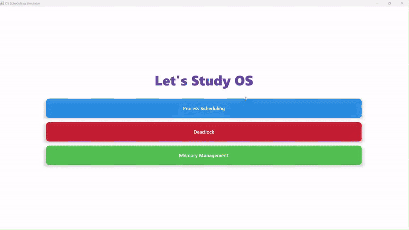

# 🖥️ Operating System — Kotlin Multiplatform

> ## 🔒 Operating System — Public Portfolio
>
> **Public Portfolio • Private/Original Implementation**
>
> This repository contains the technical documentation, architecture,
> platform overview, demonstrations, and project materials for the
> Operating System project.
>
> The portfolio intentionally does not reproduce the complete source code.
>
> 👨‍💻 **Recruiters & Technical Evaluators**
>
> 📩 For implementation review or source-code access, contact the author.
> 
> Contact: [hvsr29march2004@gmail.com](mailto:hvsr29march2004@gmail.com)
>
> [**View Original Repository →**](https://github.com/ItsDeadlyProgrammer/OperatingSystem)

---

## 🚀 Live Demo & Walkthrough

### 🌐 Web Simulator
Experience the full application directly in your browser, compiled to WebAssembly for native performance:
[**Launch Live Web Demo →**](https://itsdeadlyprogrammer.github.io/OperatingSystem/)

### 📱 Android & Desktop Downloads
Get the pre-built binaries from the original repository:

### 🎬 Video Demonstration
A complete walkthrough of the OS Simulator's features and multi-platform capabilities.

  
   
  <i>Interactive OS simulation and visualization walkthrough</i>

---

## Overview

**OS Simulator** is a comprehensive, multi-platform educational tool designed to visualize and simulate core Operating System concepts. Built with **Kotlin Multiplatform (KMP)** and **Compose Multiplatform**, it provides a consistent and interactive experience across Android, Desktop, and Web (WasmJs) platforms.

The project explores complex system behaviors through dynamic visualizations and algorithmic simulations, focusing on:
- **CPU Process Scheduling**: Visualizing process execution and performance metrics.
- **Deadlock Management**: Detecting circular waits and demonstrating avoidance strategies.
- **Memory Allocation**: Simulating continuous memory management and fragmentation.

## ✨ Core Features

### 1. ⏱️ CPU Process Scheduling
Simulate and compare classic scheduling algorithms with dynamic **Gantt Chart** visualization.
- **Algorithms:** FCFS, SJF (Preemptive/Non-Preemptive), SRTF, Round Robin, and Priority (Preemptive/Non-Preemptive).
- **Metrics:** Real-time calculation of **Average Waiting Time (AWT)** and **Average Turnaround Time (ATT)**.

### 2. 🚦 Deadlock Detection & Avoidance
Interactive visualization of Resource Allocation Graphs (RAG) and safety analysis.
- **RAG Visualization:** Dynamically builds and updates the resource graph.
- **Safety Check:** Implementation of the Banker's Algorithm style safety check to compute **Safe Sequences**.
- **Detection:** Actively identifies potential deadlock conditions (circular waits) in the resource graph.

### 3. 🧠 Continuous Memory Management
Demonstration of memory partitioning and allocation strategies.
- **Strategies:** First Fit, Best Fit, Worst Fit, and Next Fit.
- **Visualization:** Clear visualization of memory partitioning, allocation, and deallocation.
- **Fragmentation Analysis:** Calculation and visualization of **Internal and External Fragmentation**.

## 📱 Multiplatform Support

| Platform | Technology | Status |
|---|---|---|
| **Android** | Kotlin + Compose Multiplatform | Verified |
| **Desktop (JVM)** | JVM + Compose Multiplatform | Verified |
| **Web (WasmJs)** | Kotlin/Wasm + Compose Multiplatform | Verified |
| **iOS** | Kotlin + Compose Multiplatform | Verified (Infrastructure present) |

## 🛠️ Tech Stack

| Category | Technology |
|---|---|
| **Language** | Kotlin |
| **UI Framework** | Compose Multiplatform |
| **Architecture** | MVVM / State-Driven UI |
| **Platform** | Kotlin Multiplatform (Android, JVM, WasmJs, iOS) |
| **Build System** | Gradle (Kotlin DSL) |
| **Lifecycle** | AndroidX Lifecycle (Shared in Common) |

---

## 📂 Portfolio Structure

- [**📁 Architecture**](./docs/architecture.md): High-level system design and module relationships.
- [**📁 Algorithms**](./docs/algorithms.md): Detailed breakdown of implemented OS algorithms.
- [**📁 Technical Overview**](./docs/technical-overview.md): Engineering details and technology choices.
- [**📁 Platform Support**](./docs/platform-support.md): Deployment and target-specific details.
- [**📁 Engineering Decisions**](./docs/engineering-decisions.md): Reasoning behind architectural choices.
- [**📁 Project Structure**](./docs/project-structure.md): Organization of the codebase.
- [**📁 Setup & Deployment**](./docs/setup-and-deployment.md): How to build and run the original project.
- [**🖼️ Screenshots**](./screenshots/README.md): Visual gallery of the application.
- [**🎬 Demo Gallery**](./demo/README.md): Video walkthrough and live demo link.

---

## 🧑‍💻 Author

**Harshvardhan Singh**  

❤️ This project demonstrates complex data structure visualization and the efficiency of Kotlin Multiplatform for cross-platform educational tools. ❤️
