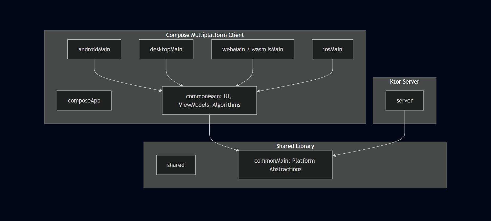

# Architecture Diagram 

### Suggested Content:
1. **Dependency Graph**: Showing `:composeApp` depending on `:shared`.
2. **KMP Targets**: Illustrating the compilation flow from `commonMain` to platform-specific binaries.
3. **Layered Architecture**: UI -> ViewModel -> Domain -> Algorithm.

*Note: You can use tools like IntelliJ's "Dependency Diagram" to generate the base for this.*
