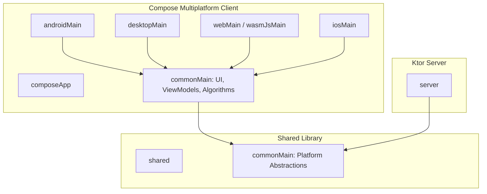

# Architecture Overview

This project follows a modern, multi-platform architecture leveraging **Kotlin Multiplatform (KMP)** and **Compose Multiplatform**. The design emphasizes code sharing while allowing for platform-specific optimizations.

## High-Level Architecture

The project is divided into several Gradle modules, each serving a specific role in the ecosystem:

## Module Responsibilities

### 1. `:composeApp`
This is the heart of the application. It contains the shared UI and business logic.
- **`commonMain`**: Contains 90%+ of the application code, including:
    - **UI Layer**: Compose Multiplatform screens and components.
    - **ViewModel Layer**: State management using `mutableStateOf` and State Holders.
    - **Domain Models**: Data structures representing Processes, Resources, and Memory blocks.
    - **Algorithms**: Implementations of CPU Scheduling, Deadlock Detection, and Memory Allocation.
- **Platform Modules (`androidMain`, `desktopMain`, etc.)**: Handle platform-specific entry points and configurations (e.g., Android Activity, JVM `main` function).

### 2. `:shared`
A library module designed to hold code shared between the client and the server.
- Contains platform-specific implementations (e.g., getting the platform name).
- Defines shared constants and basic utility functions.

### 3. `:server`
A **Ktor**-based backend module.
- Provides a simple web server implementation.
- Demonstrates the potential for expanding the simulator into a client-server architecture.

## Data & State Flow

The application utilizes a reactive, state-driven approach typical of Compose:

1.  **User Interaction**: The user interacts with the Compose UI (e.g., adding a process, clicking "Allocate").
2.  **ViewModel/State Holder**: The UI calls functions on a State Holder (or ViewModel) which manages the screen state.
3.  **Algorithmic Processing**: The State Holder invokes pure logic functions (Algorithms) with current data.
4.  **State Update**: The result of the algorithm is applied back to the state variables (`mutableStateOf`).
5.  **UI Recomposition**: Compose automatically detects the state change and re-renders the visualization (Gantt charts, Memory maps, Resource graphs).

## Visualization Engine
Visualizations are built using the **Compose Canvas API**, allowing for high-performance, cross-platform rendering of:
- Dynamic Gantt Charts for scheduling.
- Resource Allocation Graphs (RAG) for deadlock analysis.
- Block-based Memory Maps for allocation visualization.
