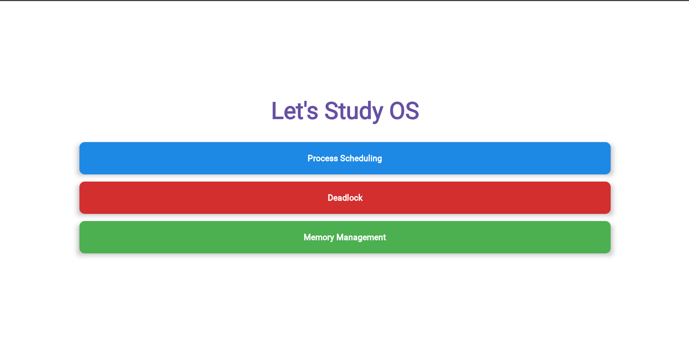
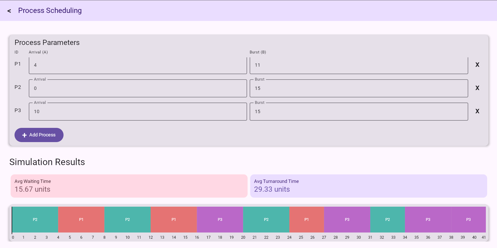
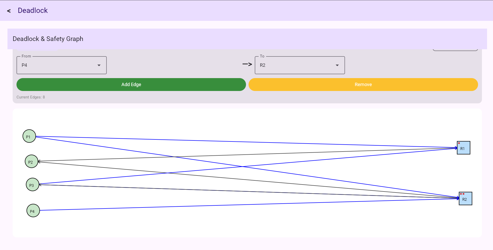
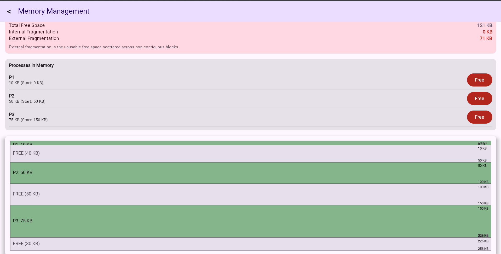

# Project Screenshots

This gallery showcases the UI and visualization capabilities of the OS Simulator across different platforms.

## 🏠 Home & Navigation
The central hub for accessing the different simulation modules.

  

## ⏱️ CPU Scheduling
Detailed visualization of process execution using dynamic Gantt charts and performance metrics.

  

## 🚦 Deadlock Analysis
Visual representation of the Resource Allocation Graph (RAG) and Banker's Safety Algorithm results.

  

## 🧠 Memory Management
Block-based visualization of partitioned memory and fragmentation analysis across different allocation strategies.

  

---

*Note: These screenshots demonstrate the consistent UI across Android, Desktop, and Web targets achieved via Compose Multiplatform.*
